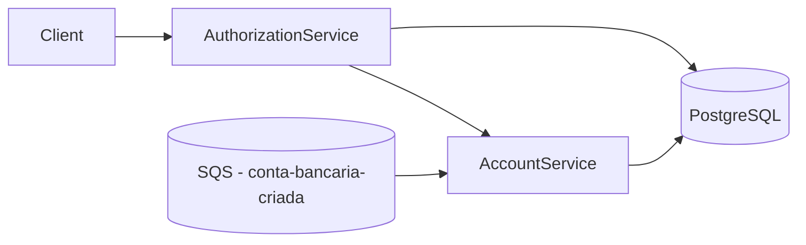

# Transaction Authorization System

Sistema de autorização de transações financeiras baseado em microsserviços, com comunicação síncrona (REST) e assíncrona (SQS), foco em **consistência**, **idempotência** e **concorrência**.

O projeto demonstra uma abordagem robusta para processamento de transações de **crédito e débito**, com persistência de saldo, controle de concorrência e execução totalmente reproduzível via Docker.

---

## 🏗️ Arquitetura da Solução

A solução é composta por dois microsserviços principais e uma infraestrutura de apoio:

- **authorization-service**
  - Exposição da API pública de autorização de transações
  - Orquestra o processamento chamando o account-service
- **account-service**
  - Responsável por contas, saldos e operações
  - Consome eventos de criação de conta via SQS
- **PostgreSQL**
  - Persistência de contas e operações
- **Amazon SQS (LocalStack)**
  - Criação de contas de forma assíncrona e desacoplada

### Diagrama de Arquitetura



---

## 🧰 Tecnologias Utilizadas

- Java 21
- Spring Boot 3.5.9
- Spring Data JPA
- PostgreSQL
- AWS SQS (LocalStack)
- Docker / Docker Compose
- Swagger / OpenAPI
- JUnit 5 / Mockito

---

## 📁 Estrutura do Repositório

```text
transaction-authorization-case/
├── account-service/
├── authorization-service/
├── docker-compose.yml
└── README.md
```

---

## ▶️ Como Executar o Projeto Localmente

### Pré-requisitos
- Docker + Docker Compose
- AWS CLI

### Subir todo o ambiente

```bash
docker compose up --build
```

Serviços disponíveis:
- authorization-service: http://localhost:8080
- account-service: http://localhost:8081

---

## 📬 Criação de Conta via Evento (SQS)

As contas são criadas a partir de eventos publicados na fila SQS `conta-bancaria-criada`.  
O saldo inicial da conta é sempre **ZERO**.

### Payload do evento

```json
{
  "account": {
    "id": "UUID",
    "owner": "string",
    "created_at": "epoch_seconds",
    "status": "ENABLED"
  }
}
```

### Enviar mensagem (Windows CMD)

```bat
aws --region sa-east-1 --endpoint-url=http://localhost:4566 sqs send-message ^
  --queue-url http://localhost:4566/000000000000/conta-bancaria-criada ^
  --message-body "{\"account\":{\"id\":\"UUID\",\"owner\":\"owner\",\"created_at\":\"1634874339\",\"status\":\"ENABLED\"}}"
```

---

## 💳 Autorização de Transações

### Endpoint Público

```
POST /transactions/{transactionId}
```
- `transactionId` é um UUID e garante idempotência

### Regras de Negócio
- **CREDIT**
    - Incrementa o saldo da conta
- **DEBIT**
    - Subtrai o saldo da conta
    - Caso a operação resulte em saldo negativo, a transação é marcada como `FAILED` e o saldo não é alterado

### Exemplo de CREDIT

```bash
curl -X POST "http://localhost:8080/transactions/{transactionId}" ^
  -H "Content-Type: application/json" ^
  -d "{
    \"accountId\": \"UUID\",
    \"type\": \"CREDIT\",
    \"amount\": { \"value\": 50.00, \"currency\": \"BRL\" },
    \"timestamp\": \"2025-12-30T15:05:00Z\"
  }"
```

---

## 🔁 Idempotência e Concorrência

- **Idempotência**
  - Garantida pelo `transactionId`
  - Repetições da mesma requisição retornam sempre o mesmo resultado, sem efeitos colaterais
- **Concorrência**
  - Operações de saldo utilizam lock pessimista no banco de dados
  - Evita race conditions em cenários de múltiplas transações simultâneas
Esses mecanismos são fundamentais para garantir consistência em sistemas financeiros.
---

## 🧠 Decisões de Arquitetura

- Uso de SQS
  - Comunicação assíncrona e desacoplada
  - Resiliência a falhas e tolerância a reprocessamentos
- PostgreSQL
  - Forte consistência transacional
  - Suporte nativo a locks e controle de concorrência
- Idempotência por chave natural
  - Evita duplicidade de efeitos em cenários de retry
  - Essencial em arquiteturas distribuídas
- Separação clara de responsabilidades
  - authorization-service orquestra o fluxo
  - account-service mantém estado e regras de negócio  
---

## 🚀 Considerações para Produção

- DLQ e retry com backoff
- Observabilidade e métricas
- Estratégias de deploy seguras (Blue/Green, Canary)

---

## 📚 Documentação da API

A documentação interativa das APIs está disponível via Swagger:

- Swagger Authorization Service  
  http://localhost:8080/swagger-ui.html

- Swagger Account Service  
  http://localhost:8081/swagger-ui.html

## ✅ Conclusão

Este projeto prioriza clareza arquitetural, segurança transacional e facilidade de execução local, demonstrando uma abordagem consistente e escalável para autorização de transações financeiras.
