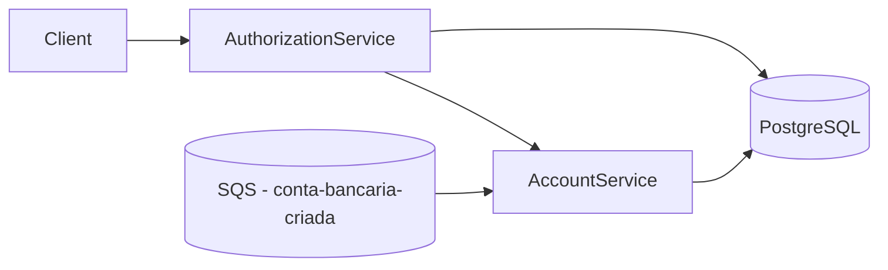

# Transaction Authorization System

Sistema de autorização de transações financeiras baseado em microsserviços, com comunicação síncrona (REST) e assíncrona (SQS), foco em **consistência**, **idempotência** e **concorrência**.

O projeto demonstra uma abordagem robusta para processamento de transações de **crédito e débito**, com persistência de saldo, controle de concorrência e execução totalmente reproduzível via Docker.

---

## 🏗️ Arquitetura da Solução

A solução é composta por dois microsserviços principais e uma infraestrutura de apoio:

- **authorization-service**
  - Exposição da API pública de autorização de transações
  - Orquestra o processamento chamando o account-service
- **account-service**
  - Responsável por contas, saldos e operações
  - Consome eventos de criação de conta via SQS
- **PostgreSQL**
  - Persistência de contas e operações
- **Amazon SQS (LocalStack)**
  - Criação de contas de forma assíncrona e desacoplada

### Diagrama de Arquitetura



---

## 🧰 Tecnologias Utilizadas

- Java 21
- Spring Boot 3.5.9
- Spring Data JPA
- PostgreSQL
- AWS SQS (LocalStack)
- Docker / Docker Compose
- Swagger / OpenAPI
- JUnit 5 / Mockito

---

## 📁 Estrutura do Repositório

```text
transaction-authorization-case/
├── account-service/
├── authorization-service/
├── docker-compose.yml
└── README.md
```

---

## ▶️ Como Executar o Projeto Localmente

### Pré-requisitos
- Docker + Docker Compose
- AWS CLI

### Subir infraestrutura base

```bash
docker compose up -d localstack account-postgres
```

---

## ⚡ Teste com Carga (Criação Massiva de Contas)

O projeto inclui um **gerador de mensagens** para simular carga realista, criando milhares de contas via SQS.

Esse processo é **opcional** e controlado por *profile* no Docker Compose.

### 1️⃣ Rodar o gerador de contas

```bash
docker compose --profile load up message-generator
```

### 2️⃣ Verificar se a fila foi preenchida

```bash
aws --region sa-east-1 --endpoint-url=http://localhost:4566 sqs get-queue-attributes ^
  --queue-url http://localhost:4566/000000000000/conta-bancaria-criada ^
  --attribute-names ApproximateNumberOfMessages
```

### 3️⃣ Subir o consumer (account-service)

```bash
docker compose up -d account-service
```

### 4️⃣ Validar criação das contas no banco

```bash
docker exec -it account-postgres psql -U account -d accountdb
```

```sql
select count(*) from accounts;
```

### 5️⃣ Subir o authorization-service

```bash
docker compose up -d authorization-service
```

---

## 💳 Autorização de Transações

### Endpoint Público

```
POST /transactions/{transactionId}
```
- `transactionId` é um UUID e garante idempotência

### Regras de Negócio
- **CREDIT**
    - Incrementa o saldo da conta
- **DEBIT**
    - Subtrai o saldo da conta
    - Caso a operação resulte em saldo negativo, a transação é marcada como `FAILED` e o saldo não é alterado

### 🧪 Teste Manual do Fluxo Completo
Os comandos abaixo validam o comportamento esperado do sistema, incluindo
**crédito**, **débito** e **idempotência**.

💡 **Observação**  
Os exemplos de `curl` utilizam o formato do **Windows (CMD / PowerShell)**.  
Em **Linux/macOS**, ajuste o escape de aspas ou utilize aspas simples (`'`).

Antes de executar, obtenha um accountId válido no banco:
```sql
docker exec -it account-postgres psql -U account -d accountdb
```
```sql
select id from accounts limit 1;
```

### 1️⃣ Testar CREDIT

```bash
curl -X POST "http://localhost:8080/transactions/11111111-1111-1111-1111-111111111111" ^
  -H "Content-Type: application/json" ^
  -d "{
    \"accountId\": \"<UUID_DO_BANCO>\",
    \"type\": \"CREDIT\",
    \"amount\": { \"value\": 50.00, \"currency\": \"BRL\" },
    \"timestamp\": \"2025-12-30T15:05:00Z\"
  }"

```

### ✅ Esperado (exemplo de resposta)
```json
{
    "transaction": {
        "id": "11111111-1111-1111-1111-111111111111",
        "type": "CREDIT",
        "amount": {
            "value": 50.00,
            "currency": "BRL"
        },
        "status": "SUCCEEDED",
        "timestamp": "2025-12-30T15:05:00Z"
    },
    "account": {
        "id": "<UUID_DO_BANCO>",
        "balance": {
            "amount": 50.00,
            "currency": "BRL"
        }
    }
}
```
💡 Observação: os valores de UUID são ilustrativos.

### 2️⃣ Testar DEBIT

```bash
curl -X POST "http://localhost:8080/transactions/22222222-2222-2222-2222-222222222222" ^
  -H "Content-Type: application/json" ^
  -d "{
    \"accountId\": \"<UUID_DO_BANCO>\",
    \"type\": \"DEBIT\",
    \"amount\": { \"value\": 10.00, \"currency\": \"BRL\" },
    \"timestamp\": \"2025-12-30T15:06:00Z\"
  }"
```

### ✅ Esperado (exemplo de resposta)
```json
{
    "transaction": {
        "id": "22222222-2222-2222-2222-222222222222",
        "type": "DEBIT",
        "amount": {
            "value": 10.00,
            "currency": "BRL"
        },
        "status": "SUCCEEDED",
        "timestamp": "2025-12-30T15:06:00Z"
    },
    "account": {
        "id": "<UUID_DO_BANCO>",
        "balance": {
            "amount": 40.00,
            "currency": "BRL"
        }
    }
}
```

### 3️⃣ Provar IDEMPOTÊNCIA (ponto-chave)
Repetir exatamente a mesma requisição, usando o mesmo transactionId:

```bash
curl -X POST "http://localhost:8080/transactions/22222222-2222-2222-2222-222222222222" ^
  -H "Content-Type: application/json" ^
  -d "{
    \"accountId\": \"<UUID_DO_BANCO>\",
    \"type\": \"DEBIT\",
    \"amount\": { \"value\": 10.00, \"currency\": \"BRL\" },
    \"timestamp\": \"2025-12-30T15:06:00Z\"
  }"
```

### ✅ Esperado (exemplo de resposta)
```json
{
    "transaction": {
        "id": "22222222-2222-2222-2222-222222222222",
        "type": "DEBIT",
        "amount": {
            "value": 10.00,
            "currency": "BRL"
        },
        "status": "SUCCEEDED",
        "timestamp": "2025-12-30T15:06:00Z"
    },
    "account": {
        "id": "<UUID_DO_BANCO>",
        "balance": {
            "amount": 40.00,
            "currency": "BRL"
        }
    }
}
```
- resposta idêntica à chamada anterior
- saldo não é alterado
- nenhuma nova operação criada no banco

Esse comportamento garante idempotência, essencial em sistemas financeiros distribuídos.

---

## 🔁 Idempotência e Concorrência

- **Idempotência**
  - Garantida pelo `transactionId`
  - Repetições da mesma requisição retornam sempre o mesmo resultado, sem efeitos colaterais
- **Concorrência**
  - Operações de saldo utilizam lock pessimista no banco de dados
  - Evita race conditions em cenários de múltiplas transações simultâneas
Esses mecanismos são fundamentais para garantir consistência em sistemas financeiros.

---

## 🧠 Decisões de Arquitetura

- Uso de SQS
  - Comunicação assíncrona e desacoplada
  - Resiliência a falhas e tolerância a reprocessamentos
- PostgreSQL
  - Forte consistência transacional
  - Suporte nativo a locks e controle de concorrência
- Idempotência por chave natural
  - Evita duplicidade de efeitos em cenários de retry
  - Essencial em arquiteturas distribuídas
- Separação clara de responsabilidades
  - authorization-service orquestra o fluxo
  - account-service mantém estado e regras de negócio  
---

## 🚀 Considerações para Produção

- DLQ e retry com backoff
- Observabilidade e métricas
- Estratégias de deploy seguras (Blue/Green, Canary)

---

## 📚 Documentação da API

A documentação interativa das APIs está disponível via Swagger:

- Swagger Authorization Service  
  http://localhost:8080/swagger-ui.html

- Swagger Account Service  
  http://localhost:8081/swagger-ui.html

## ✅ Conclusão

Este projeto prioriza clareza arquitetural, segurança transacional e facilidade de execução local, demonstrando uma abordagem consistente e escalável para autorização de transações financeiras.
